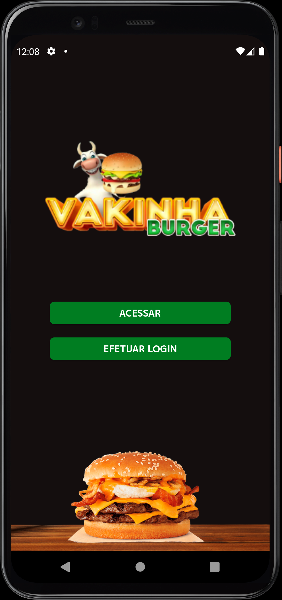
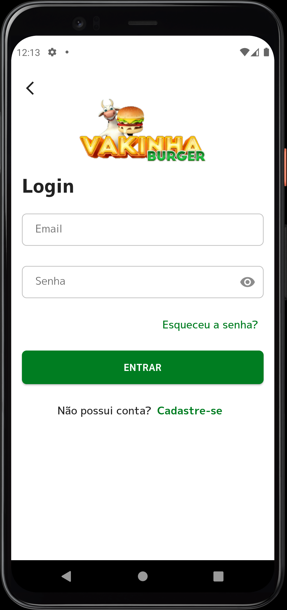
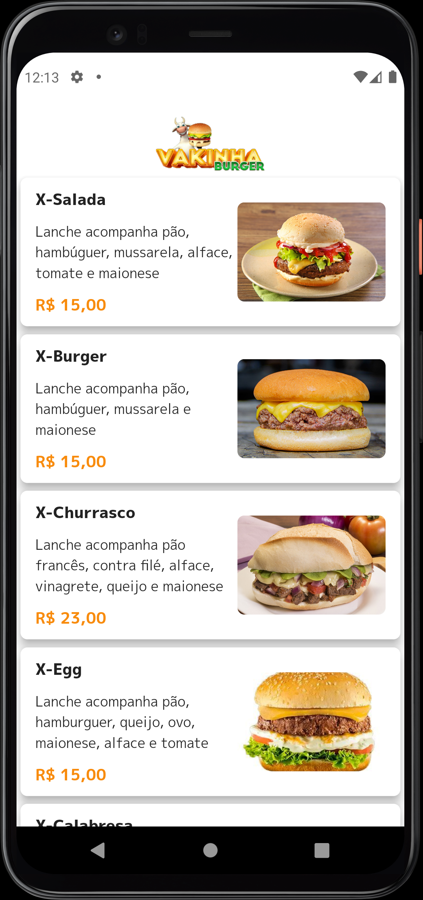
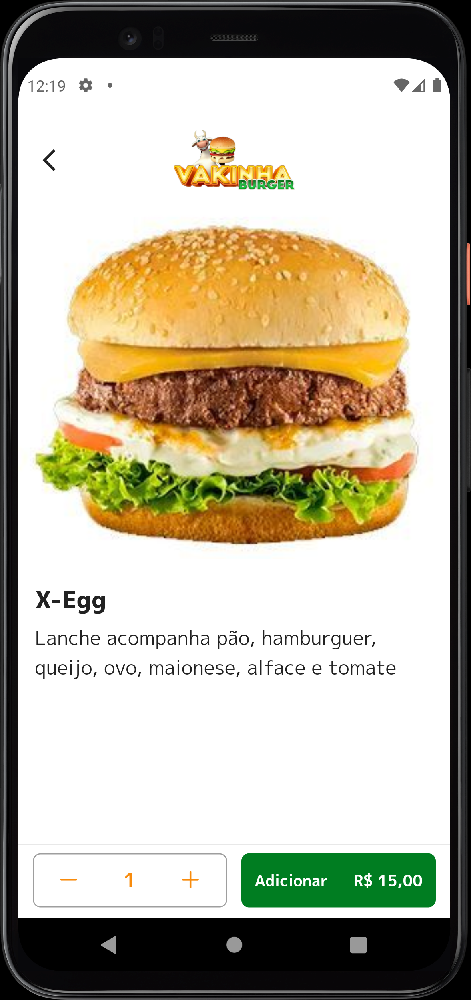
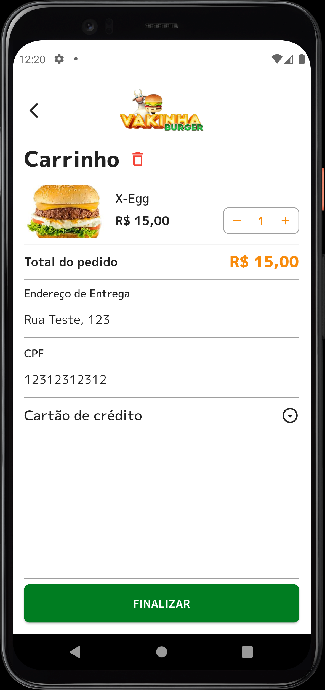
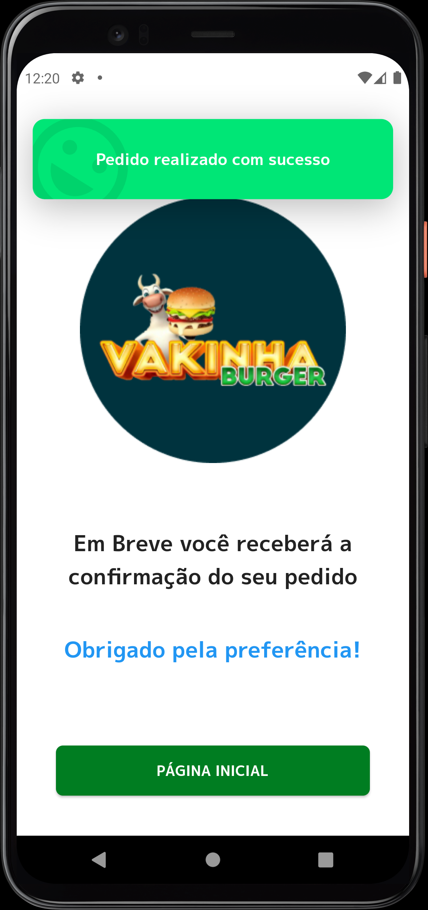

# Vakinha Burger - Dart Week 9

# 📃 Sobre

Este projeto foi criado com o intuito de aprender sobre Bloc na prática, durante a Imersão Dart Week 9 da Academia do Flutter.
Muitos conceitos ensinados, eu já vinha utlizando, porém pude aprender coisas interessantes além do Bloc, como utilizar o BuildContext de outras maneiras, melhorar o sistema de navegação, aprendi mais sobre Singleton, aumentar a capacidade do Dio em auxiliar o sistema de Autenticação e muitas outras coisas. 

## 🔨 Tecnologias e Dependências

   

### Flutter version = 3.3.10

- flutter_dotenv: 5.0.2
- provider: 6.0.5
- dio: 4.0.6
- auto_size_text: 3.0.0
- intl: 0.18.0
- loading_animation_widget: 1.2.0+4
- top_snackbar_flutter: 3.0.0+1
- equatable: 2.0.5
- bloc: 8.1.0
- flutter_bloc: 8.1.1
- match: 0.4.1
- validatorless: 1.2.3
- shared_preferences: 2.0.17
- modal_bottom_sheet: 2.1.2
- cupertino_icons: 1.0.5
- flutter_awesome_select: 6.5.0
---

## 🚀 Instalação e execução

**Clone o repositório.**

Subir o servidor com o comando `jrs run` pelo prompt (utilizar o caminho da pasta backend que está na raiz do repositório).

Link para dúvidas:
https://pub.dev/packages/json_rest_server

Ao abrir o projeto executar o `pub get` no arquivo pubspec.yaml e depois rodar no
emulador.

---
## 📱 Features

- Não é necessário efetuar cadastro para visualizar partes do app
- Cadastro e login de usuários
- Produtos bem visíveis e descrição clara
- Carrinho com fácil adição e remoção de produtos
- Fechamento do pedido com Endereço e CPF para envio dos itens
- Forma de pagamento de fácil acesso
- Mensagem de finalização do pedido personalizada

---

### Visual clean e direto.

  
   
   
   
   
   

---
<h3 align="left">Connect with me:</h3>

